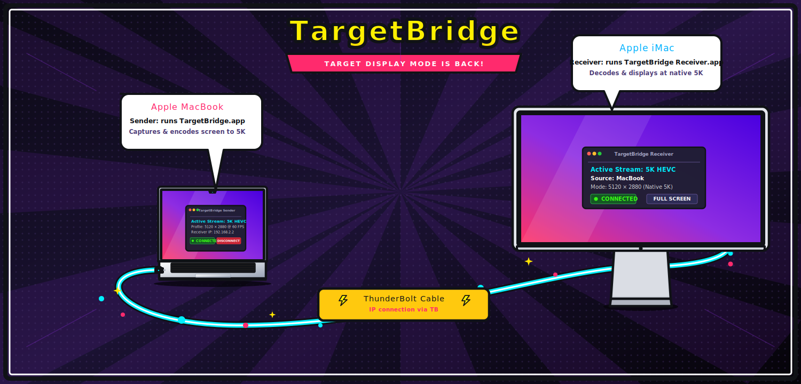
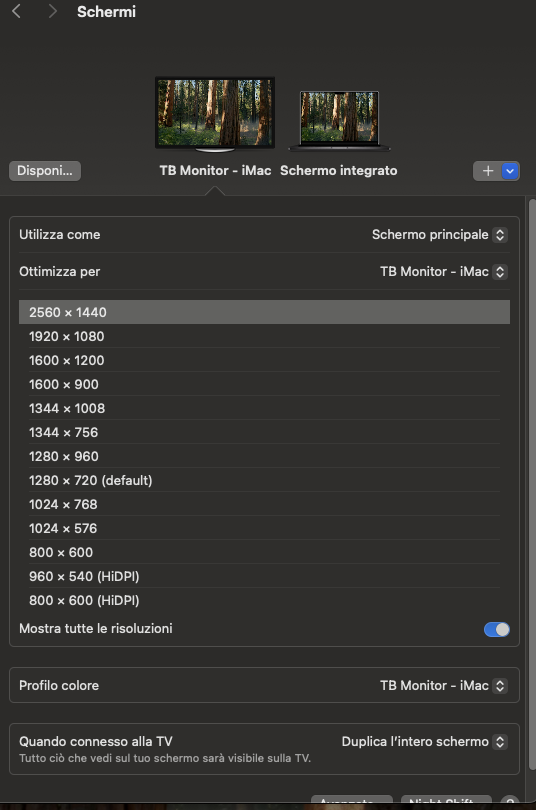

# TargetBridge

Use an iMac as an external display for another Mac by just using a Thunderbolt cable (TargetBridge uses an IP connection over the Thunderbolt Bridge).

If TargetBridge is useful to you, a ⭐ on GitHub helps others find it.

Apple dropped Target Display Mode in 2014 with the 5K iMac — and it never came back. TargetBridge brings it back via software, streaming your screen to the iMac at up to 5K.

## Screenshots

**Sender (MacBook) — waiting for connection:**

**Sender — active stream (5K, HEVC):**

**Receiver (iMac) — waiting for sender:**

**iMac connected at native resolution via Thunderbolt:**

## Download

**[→ Download latest release (pre-built apps, no Xcode needed)](https://github.com/swellweb/targetBridge/releases/latest)**

- `TargetBridge.app.zip` — Sender (Apple Silicon, **requires macOS 14 Sonoma or later**)
- `TargetBridge-Receiver.app.zip` — Receiver (Intel iMac, **requires macOS 13 Ventura or later**)

Unzip and double-click. On first launch, grant Screen Recording permission to the sender.

> **Pre-built receiver crashing?** Make sure you downloaded v1.2.0 or later — older builds required Homebrew or macOS 14. Re-download from the [latest release](https://github.com/swellweb/targetBridge/releases/latest).

## Hardware Requirements

- Sender: any Mac with TB3/4/5 (late 2016 or later)
- Receiver: any iMac with TB3/4/5 (2017 or later)
- Thunderbolt 3/4/5 cable (cables are backwards compatible)

## Stream profiles

- `Standard · 2560 × 1440` — conservative baseline
- `Smooth · 2560 × 1440 @ 60` — lower latency motion
- `Smooth+ · 3200 × 1800 @ 60` — sharper motion profile
- `Crisp · 3840 × 2160 @ 48` — clearer text with HEVC
- `5K · 5120 × 2880 @ 48` — native iMac 5K stream with HEVC

The sender can stream either an extended virtual display or a mirror of the sender display.

## Extended Desktop

For an extended desktop, choose `Extended display` on the sender before connecting. After the virtual display appears, open macOS **System Settings → Displays → Arrange** on the sender Mac and position the external display where you want it.

If the receiver does not fill the iMac panel or the cursor/desktop feels scaled incorrectly, select the external TargetBridge display in macOS Display Settings and choose the matching resolution. For the 27-inch 5K iMac path, use a high-clarity stream profile such as `Crisp` or `5K` with the external display set to the matching 2560 × 1440 HiDPI mode.

## Projects

- `TargetBridge-Sender`
- `TargetBridge-Receiver`

## Quick start

- Italian: `TargetBridge-QuickStart-IT.md`
- English: `TargetBridge-QuickStart-EN.md`
